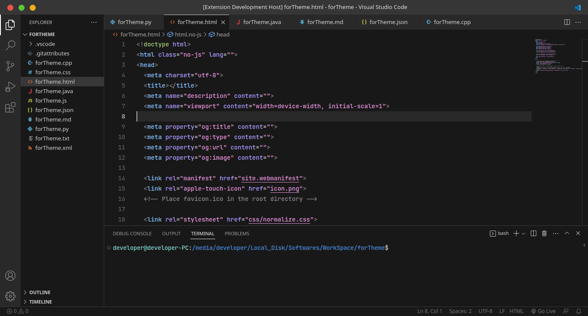

# Jetbrains Fleet color themes

Jetbrains Fleet color themes contain one basic theme, Fleet Dark.

## Supported Languages

* HTML
* CSS
* JS
* C++
---

## Applying theme

### To apply theme:
* Ctrl+Shift+P -> Preferences: Color Theme -> Fleet Dark
---

## Preview

* Fleet Dark

---

**Enjoy!**
